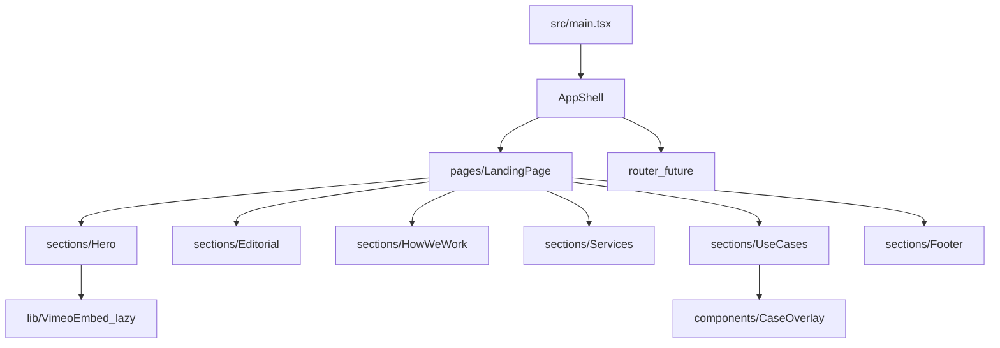

# Henyo repo refactor plan (leaner, faster, scalable)

## What we found (current state)

- **Monolithic app**: Most behavior + content lives in a single file: [`src/App.tsx`](c:/Users/buyss/Dropbox/03_Thoughtform/08_Artifacts/08_Henyo/src/App.tsx) (scroll handling, timers, data, rendering).
- **Performance hotspot**: Many **autoplay Vimeo iframes** are rendered simultaneously (hero + services + “use cases” loop + overlay), which is typically the #1 contributor to main-thread work, network, and memory.
- **CSS bloat**: [`src/index.css`](c:/Users/buyss/Dropbox/03_Thoughtform/08_Artifacts/08_Henyo/src/index.css) appears to be a **precompiled Tailwind v4 output** committed to the repo; [`src/styles/globals.css`](c:/Users/buyss/Dropbox/03_Thoughtform/08_Artifacts/08_Henyo/src/styles/globals.css) is a Tailwind-source file but is **not imported**.
- **Shadcn present but not actually used yet**: `src/components/ui/*` exists and references Radix/sonner/etc, but the landing page doesn’t import these components today.
- **Missing foundations for “scalable”**: no `tsconfig`, no lint/format, no shadcn `components.json`.

## Target architecture (single page now, multi-page later)

- **Now**: `AppShell` renders `LandingPage` directly.
- **Later**: add a router and pages (`/work`, `/services`, `/use-cases/:slug`) without rewriting the landing page.

## Phase 1 — Establish a maintainable baseline (fast, low risk)

- **Add TypeScript project config** so we can safely refactor:
- Add `tsconfig.json`, `tsconfig.node.json`.
- Add `typescript`, `@types/react`, `@types/react-dom`.
- Add scripts: `typecheck`, `preview`.
- **Add formatting/linting** to keep the repo clean as it grows:
- Add ESLint (React + TS) and Prettier.
- Add scripts: `lint`, `format`.
- **Pin wildcard deps** (`clsx`, `tailwind-merge`) to fixed versions to avoid surprise breakages.

## Phase 2 — Fix CSS pipeline (big “lean” win)

- Replace the committed Tailwind output with a proper Tailwind build:
- Make [`src/styles/globals.css`](c:/Users/buyss/Dropbox/03_Thoughtform/08_Artifacts/08_Henyo/src/styles/globals.css) the single source of truth.
- Update [`src/main.tsx`](c:/Users/buyss/Dropbox/03_Thoughtform/08_Artifacts/08_Henyo/src/main.tsx) to import `styles/globals.css`.
- Introduce Tailwind v4 + Vite integration (so the production CSS only includes used utilities).
- Optional (recommended): **self-host fonts** currently loaded via CSS `@import` for better performance + stability.

## Phase 3 — Break up `App.tsx` into sections + hooks (scalable structure)

- Create `src/pages/LandingPage.tsx` and move each chapter into `src/sections/*`.
- Move content/data (e.g., `useCases[]`) into `src/content/*` (typed) so later “/use-cases” pages can reuse it.
- Extract reusable hooks:
- `useMediaQuery` / `useIsMobile`
- `useReducedMotion`
- `useInterval`
- `useScrollSpy` (or replace with IntersectionObserver—see Phase 4)

## Phase 4 — Performance pass (largest impact)

- **Replace scroll event work** with IntersectionObserver where possible:
- Active nav section tracking
- Entrance animations
- “Load video when visible”
- **Lazy-load/virtualize Vimeo embeds**:
- For carousels/cards: render thumbnails first; only mount `<iframe>` on interaction or when near viewport.
- For the overlay: mount only the currently visible media; unmount previous iframes on index change.
- Add `prefers-reduced-motion` behavior: disable auto-advance + reduce continuous animations.
- **Code-split heavy UI**:
- Lazy-load the case overlay and/or use-cases section.

## Phase 5 — Keep shadcn, but slim it down and isolate it

- Add shadcn config (`components.json`) so “add/remove components” is standardized.
- **Prune `src/components/ui` to only what’s used** by the site:
- Remove unused component files.
- Remove now-unused deps (Radix packages, cmdk, recharts, etc.) from `package.json`.
- **Remove version-suffixed imports** inside `src/components/ui/*` (e.g. `next-themes@0.4.6`) so:
- Typechecking works with `tsc`.
- We can delete the long version-alias list in [`vite.config.ts`](c:/Users/buyss/Dropbox/03_Thoughtform/08_Artifacts/08_Henyo/vite.config.ts) (keeping only meaningful aliases like `@` and `figma:asset/*`).

## Phase 6 — Prepare for multi-page (when you’re ready)

- Add a router with route-level code splitting.
- Create new pages using the same section/content modules.
- Decision point (later): if SEO requirements get stricter, consider adding prerender/SSR (can be a separate follow-up plan).

## Success criteria (so we know it worked)

- **CSS size** drops materially (shipping only used Tailwind utilities).
- **Initial load** improves: fewer iframes mounted on first paint, lower main-thread work.
- **Maintainability**: `App.tsx` becomes a small composition shell; sections are isolated and testable.