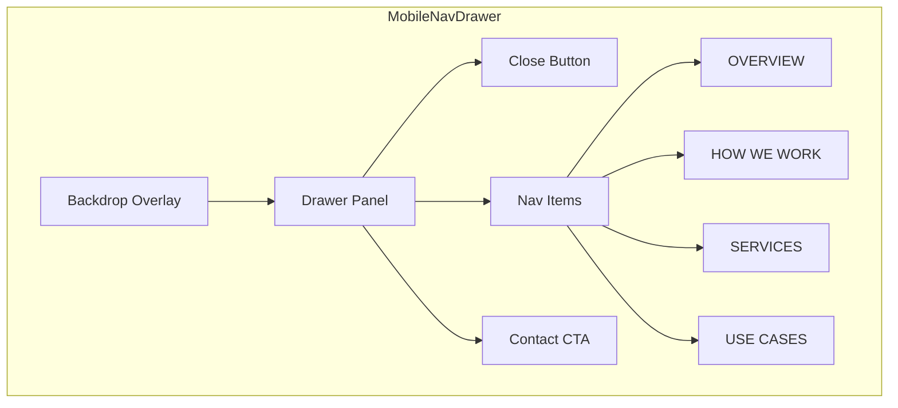

# Mobile Hamburger Navigation

## Overview

Add a distinctive hamburger menu to the mobile navbar that provides access to section navigation while maintaining Henyo's clean, professional aesthetic. The implementation will feature smooth animations, clear visual hierarchy, and excellent touch UX.

## Current State

The navbar in [`src/sections/Navbar.tsx`](src/sections/Navbar.tsx) currently hides section navigation on mobile (`hidden md:flex`), leaving users with only the logo and contact button. This limits mobile users from easily navigating between sections.

## Design Approach

Following the frontend-design skill principles:

- **Typography**: Use the existing Founders Grotesk with dramatic size jumps (nav items at 28-32px in the drawer vs 13px in desktop nav)
- **Motion**: Orchestrated entrance with staggered item reveals using `animation-delay`
- **Touch UX**: Large tap targets (48px minimum), clear active states
- **Aesthetic**: Full-screen slide-in drawer with subtle backdrop blur, avoiding generic hamburger patterns

## Implementation

### 1. Navbar Component Updates

Modify [`src/sections/Navbar.tsx`](src/sections/Navbar.tsx):

```tsx
// Add hamburger button for mobile (left of logo or right area)
<button 
  className="md:hidden p-2 -ml-2" 
  onClick={() => setMenuOpen(true)}
  aria-label="Open menu"
>
  <div className="w-6 flex flex-col gap-1.5">
    <span className="h-[2px] w-full bg-black" />
    <span className="h-[2px] w-full bg-black" />
  </div>
</button>
```


### 2. Mobile Drawer Component

Create [`src/components/MobileNavDrawer.tsx`](src/components/MobileNavDrawer.tsx):

- Full-screen overlay with `backdrop-blur-sm` and semi-transparent background
- Slide-in from left with CSS transform
- Staggered nav item entrance (each item fades up with 50ms delay)
- Active section indicator (underline or dot)
- Close button (X) and tap-outside-to-close



### 3. Animation Details

```css
/* Drawer slide-in */
.drawer-enter { transform: translateX(-100%); }
.drawer-enter-active { transform: translateX(0); transition: transform 300ms ease-out; }

/* Nav items stagger */
.nav-item { opacity: 0; transform: translateY(12px); }
.nav-item-visible { 
  opacity: 1; 
  transform: translateY(0);
  transition: opacity 200ms ease-out, transform 200ms ease-out;
}
/* delay: 0ms, 50ms, 100ms, 150ms per item */
```


### 4. Body Scroll Lock

Add scroll lock when drawer is open to prevent background scrolling:

```tsx
useEffect(() => {
  if (isOpen) {
    document.body.style.overflow = 'hidden';
  } else {
    document.body.style.overflow = '';
  }
  return () => { document.body.style.overflow = ''; };
}, [isOpen]);
```


### 5. Wire Up Navigation

Pass existing `activeSection` and `onNavigate` props to drawer. Close drawer after navigation with slight delay for visual feedback.

## Files to Create/Modify

| File | Action ||------|--------|| [`src/sections/Navbar.tsx`](src/sections/Navbar.tsx) | Add hamburger button, state management, render drawer || `src/components/MobileNavDrawer.tsx` | New component for the slide-out drawer |

## Visual Reference

The drawer will feature:

- Clean white background with subtle border
- Large typography for nav items (28px, Founders Grotesk Medium)
- Active item shown with black underline
- Inactive items in `#999999`