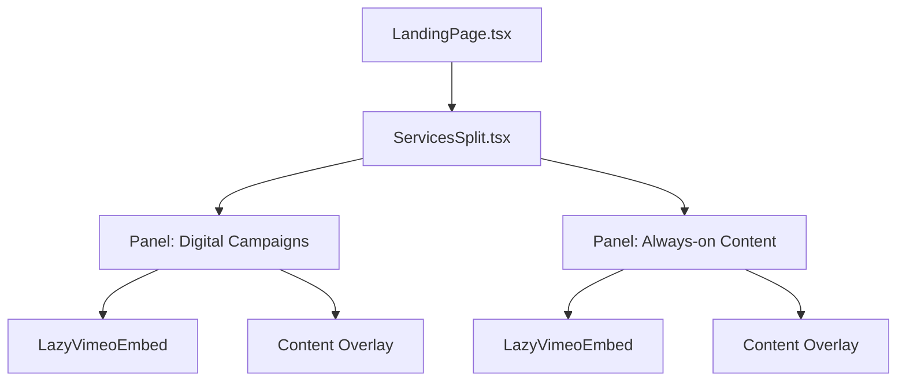

# Plan: Redesign Services Section to Split View

Redesign the current carousel-based services section into a balanced, side-by-side split view that highlights Henyo's two core offerings: **Digital Campaigns** and **Always-on Content**.

## Architecture Changes

## Proposed Changes

### 1. New Split View Component

Modify or replace [`src/components/ServicesSlides.tsx`](src/components/ServicesSlides.tsx) with a new `ServicesSplit` component:

- **Desktop Layout**: 50/50 horizontal split using CSS `flex` or `grid`.
- **Interactivity**: Add hover states where the active panel expands (e.g., `flex-[1.2]` vs `flex-[0.8]`) and increases saturation or brightness.
- **Backgrounds**: Use [`src/components/LazyVimeoEmbed.tsx`](src/components/LazyVimeoEmbed.tsx) for full-bleed video backgrounds in each panel.
- **Typography**: Apply "dramatic size jumps" for titles (e.g., 64px+ in Founders Grotesk) to match Henyo's bold aesthetic.
- **Content Overlays**: Use semi-transparent glassmorphic overlays for descriptions and the "Download Pricing" button to ensure legibility over videos.

### 2. Update Landing Page

Refactor [`src/pages/LandingPage.tsx`](src/pages/LandingPage.tsx):

- Remove the `activeService` state and auto-advance `useInterval` logic.
- Simplify the `ServicesSplit` props as it no longer needs navigation controls (`onNext`, `onPrev`, etc.).
- Ensure the section maintains its `IntersectionObserver` entrance animation but updated for the two-panel reveal.

### 3. Mobile Responsiveness

- **Mobile Layout**: Stack the panels vertically (`flex-col`).
- Maintain high-impact visuals but scale typography appropriately for smaller screens.

## Key Files

- [`src/components/ServicesSlides.tsx`](src/components/ServicesSlides.tsx): The main target for the redesign.